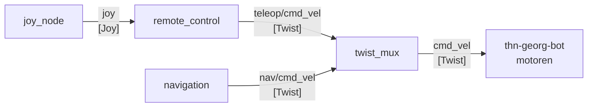

# drive

Teleoperation und Motorsteuerung

Nodes:
- [edu_robot](https://github.com/EduArt-Robotik/edu_robot) - Kommunikation mit Rädern
- [edu_robot_contol](https://github.com/EduArt-Robotik/edu_robot_control) - joystick parser
- [twist_limiter](./twist_limiter/) - begrenzung der beschleunigung
- joy_linux - joystick einlesen

